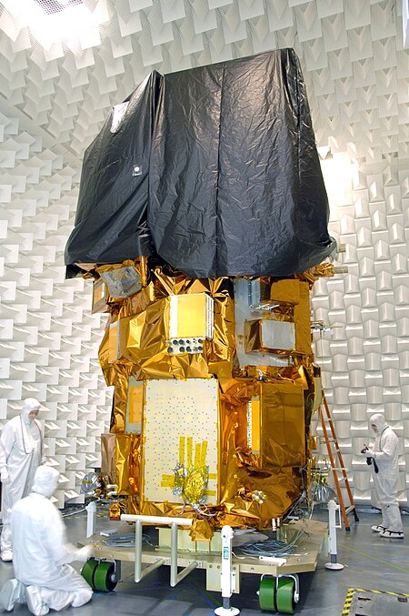
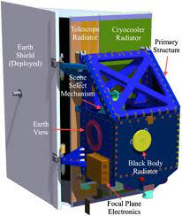

# Satellite introduction

 Landsat 8 was launched on 11 February 2013 as a joint Earth observation satellite of the United States Geological Survey (USGS) and the National Aeronautics and Space Administration (NASA). It is the eighth satellite in the Landsat series and is designed to continue a surface observation record that spans more than four decades.

{r echo=FALSE, out.width='60%', fig.align='center'}

---
# OLI and TIRS introduction

Landsat 8 carries two primary sensors: the Operational Land Imager (OLI) and the Thermal Infrared Sensor (TIRS).

.pull-left[
  The OLI sensor provides nine spectral bands, including a coastal/aerosol band, three visible bands, a near-infrared band, two short-wave infrared bands, and a panoramic band with a spatial resolution of 30 m and a panoramic band of 15 m.
  The TIRS sensor provides two thermal infrared bands for surface temperature measurements with a spatial resolution of 100 m, but is typically resampled to 30 m in data processing.
]

.pull-right[
  
  
]

---

---
U.S. Geological Survey, 2023. Landsat 8. Available at: https://www.usgs.gov/landsat-missions/landsat-8 [Accessed 4 February 2024].

Wikipedia contributors, 2023. Landsat 8. Wikipedia. Available at: https://en.wikipedia.org/wiki/Landsat_8 [Accessed 4 February 2024].
